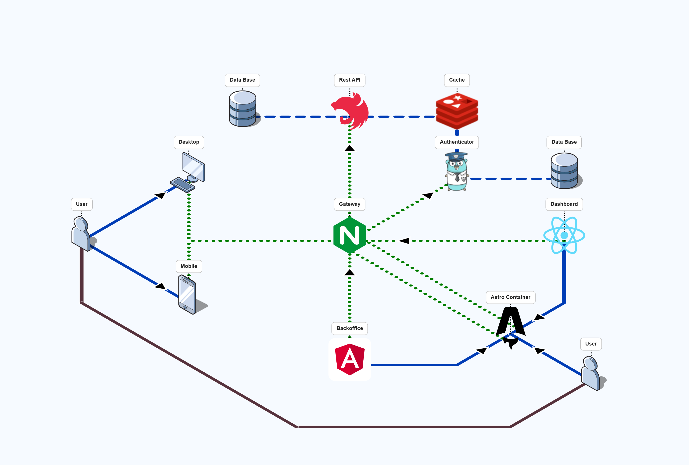

# PoC MFE CEA

## Project Objective

This project serves as a **Proof of Concept (PoC)** for a Micro-Frontend architecture implementing **Centralized Edge Authentication (CEA)**. The primary goal is to demonstrate a scalable and modular system where independent frontend applications are orchestrated by a central shell, supported by a decoupled backend infrastructure efficiently.

The architecture aims to validate the following key capabilities:

- **Modular Frontend Composition:** orchestrating distinct functionality domains (like Dashboard and Backoffice) via a main Container (Astro).
- **Centralized Security:** Enforcing authentication at the edge (Gateway level) rather than in individual services, ensuring consistency and security.
- **Polyglot Microservices:** Integrating services built with different technologies (Node.js, Go) within a unified Dockerized environment.

(Note: For better clarity on the authentication process, it is recommended to add a **Sequence Diagram** illustrating the handshake between the Gateway, Auth Service, and Client. Additionally, a **Component Diagram** could help visualize the communication interfaces between the Micro-frontends and the Container.)

## Key Benefits & Scalability

This architecture offers significant advantages for enterprise-grade application development:

### 1. Enhanced Scalability

- **Independent Scaling:** Each microservice (Auth, API) and micro-frontend can be developed, tested, and deployed independently. If the dashboard experiences high traffic, it can be optimized or scaled without affecting the backoffice.
- **Team Autonomy:** Distinct teams can own specific business domains (e.g., "Team Dashboard" vs "Team Backoffice") without blocking each other, reducing merge conflicts and accelerating feature delivery.

### 2. Centralized Edge Authentication (CEA)

- **Security Consistency:** Moving authentication to the Gateway level ensures a single point of enforcement. Backend services do not need to implement redundant auth logic; they focus purely on business rules, trusting the request context forwarded by the gateway.
- **Performance:** Offloading the auth handshake to a high-performance edge component (Nginx + Go + Redis) minimizes latency. Unauthorized requests are rejected immediately at the edge, protecting downstream services from unnecessary load.

### 3. Optimized Developer Experience

- **Monorepo Efficiency:** Powered by **Turborepo**, the build system is intelligent—caching results locally and remotely. You only test and build what has changed, drastically reducing CI/CD pipeline times.
- **Unified Dependency Management:** **pnpm** ensures strict dependency resolutions and saves significant disk space and installation time across the workspace.

### 4. Future-Proof Flexibility

- **Polyglot Support:** The architecture embraces the "right tool for the job" philosophy. High-concurrency tasks are handled by **Go**, while complex business logic utilizes **Node.js/TypeScript**.
- **Framework Agnostic Frontends:** The container pattern allows for potential mixing of frontend frameworks (e.g., React, Vue, Svelte) if future requirements dictate, orchestrated seamlessly by Astro.

## Architecture Overview

The solution adheres to a **Monorepo** structure managed by **Turborepo** and **pnpm**, organizing the system into:

### Frontend Layer

- **Container (`/container`):** The Application Shell built with **Astro**, responsible for layout, global navigation, and mounting the micro-frontends.
- **Micro-Frontends (`/backoffice`, `/dashboard`):** Independent application modules responsible for specific business domains.

### Backend & Infrastructure Layer

- **Gateway (`/gateway`):** An **Nginx** reverse proxy that acts as the entry point, routing requests and enforcing the CEA pattern.
- **Auth Service (`/auth-service`):** A lightweight, high-performance service written in **Go**, managing authentication entities and sessions with **Redis**.
- **REST API (`/rest-api`):** A **Node.js/TypeScript** service interacting with a **PostgreSQL** database to provide business data to the frontends.
